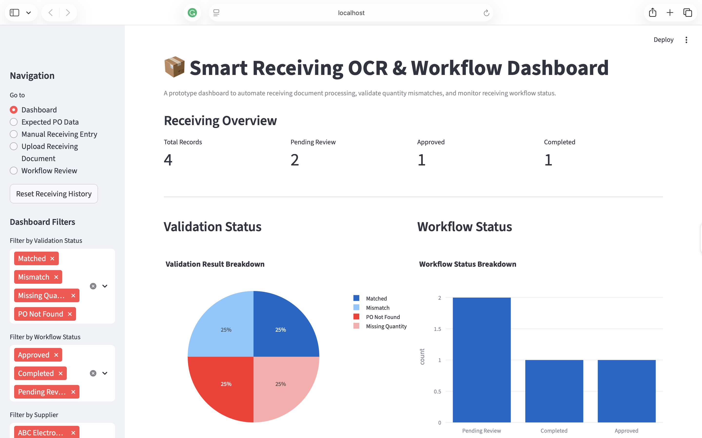
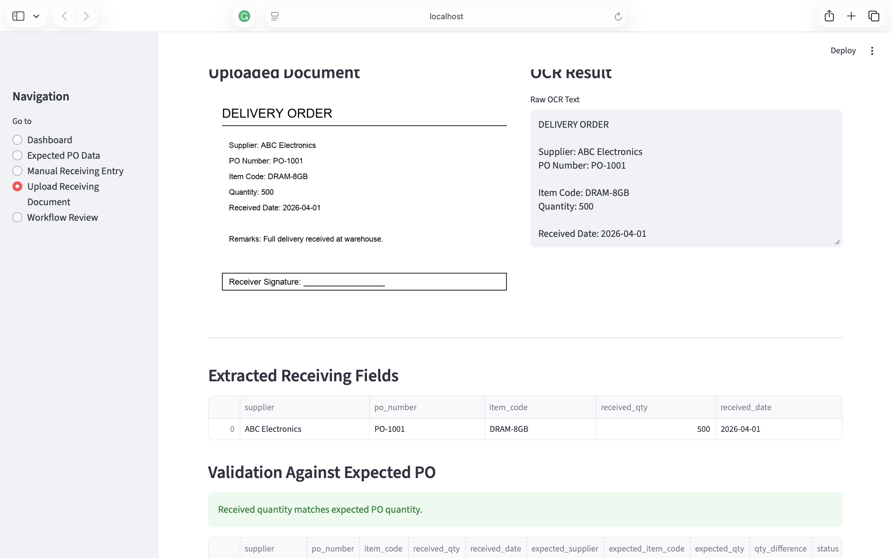
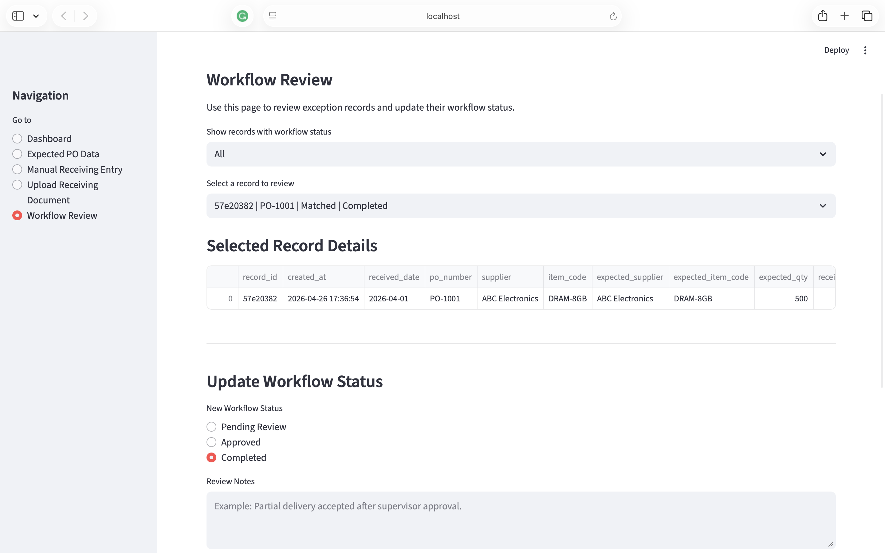

# Smart Receiving OCR & Workflow Dashboard

An OCR-powered Streamlit dashboard that automates receiving document extraction, validates PO quantity mismatches, manages exception workflows, and visualizes receiving performance for manufacturing operations.

## Live Demo

[Try the app here](https://receiving-ocr-dashboard.streamlit.app/)

## Overview

This project simulates a manufacturing receiving workflow. Users can upload delivery document images, extract key information using OCR, validate the result against expected purchase order data, and track each record through a simple workflow status.

The project is designed to reduce manual checking, flag receiving exceptions, and improve visibility in material receiving operations.

## Key Features

- Upload receiving document images
- Extract text using Tesseract OCR
- Extract key fields such as supplier, PO number, item code, quantity, and received date
- Validate received quantity against expected PO data
- Detect exception cases such as mismatch, missing quantity, and PO not found
- Save receiving records into history
- Track workflow status: Pending Review, Approved, and Completed
- Visualize receiving performance through an interactive dashboard
- Export receiving history as CSV

## Tech Stack

- Python
- Streamlit
- Pandas
- Plotly
- Tesseract OCR
- Pytesseract
- Pillow

## Workflow

```text
Upload Document → OCR Extraction → PO Validation → Workflow Review → Dashboard
```

## Validation Logic

| Case | Workflow Status |
|---|---|
| Quantity matches expected PO | Completed |
| Quantity mismatch | Pending Review |
| PO not found | Pending Review |
| Missing quantity | Pending Review |

## Sample Documents

The project includes sample receiving documents for testing:

| File | Scenario |
|---|---|
| `sample_matched.png` | Quantity matches expected PO |
| `sample_mismatch.png` | Quantity mismatch |
| `sample_po_not_found.png` | PO number not found |
| `sample_missing_quantity.png` | Missing quantity |

## Screenshots

### Dashboard



### OCR Upload and Validation



### Workflow Review



## How to Run Locally

Clone the repository:

```bash
git clone https://github.com/vanessarasubala/smart-receiving-ocr-dashboard.git
cd smart-receiving-ocr-dashboard
```

Create and activate virtual environment:

```bash
python3 -m venv .venv
source .venv/bin/activate
```

Install dependencies:

```bash
pip install -r requirements.txt
```

Install Tesseract OCR:

```bash
brew install tesseract
```

For Apple Silicon Mac, if needed:

```bash
arch -arm64 brew install tesseract
```

Run the app:

```bash
streamlit run app.py
```

## Resume Summary

Built a Smart Receiving OCR & Workflow Dashboard using Python, Streamlit, Pandas, and Tesseract OCR to automate receiving document extraction, validate PO quantity mismatches, manage exception workflows, and visualize operational receiving performance for manufacturing operations.

## Author

Vanessa Chriszella Rasubala  
GitHub: [vanessarasubala](https://github.com/vanessarasubala)